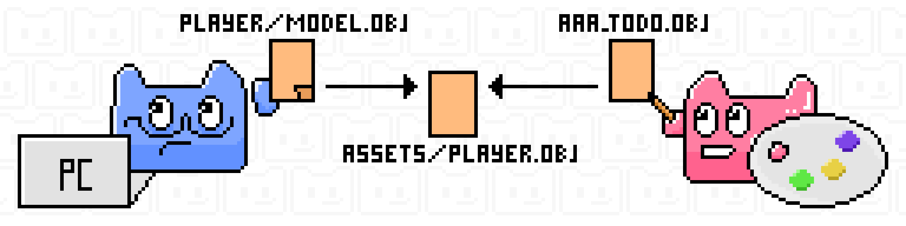
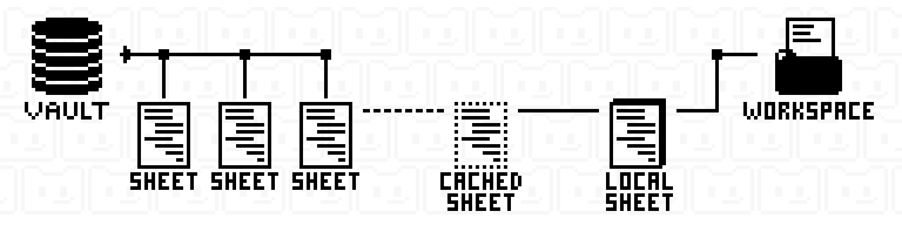

				

<h1 align="center">JustEnoughVCS</h1>

				Centralized Version Control for Multi-Structured Files

				
				
				

## Foreword

> [!Warning]
>
> `JustEnoughVCS` is under active development and there is no release plan yet.
>
> If you are interested in this project, feel free to [contact](#Support) us directly!

> [!NOTE]
>
> `JustEnoughVCS` is designed for **asset content management** and is **not suitable for source code version control**. Its multi-structure, branch-less design philosophy makes it unsuitable for any project with strong structural dependencies.

## Introduction

`JustEnoughVCS` is a **centralized version control system** that focuses on providing a simple and flexible workflow for **asset management scenarios dominated by binary files**. It does not treat file paths as the identity of a file, but separates them into the relationship between **unique identity (what the file is)** and **path mapping (where the file is)**.

> [!TIP]
>
> If you wish to install directly, you can click [here](#Installation)

### 1. Struct Sheet System

**Personal Struct Sheet**

`JustEnoughVCS` allows each member to establish their own **Struct Sheet**, which represents **that member's understanding of the files visible to them**. It does not and need not be known by other members what it looks like. Each member works within their own **Struct Sheet**, sharing the **visibility of files** with others only when necessary.

**Reference Sheet**

In the upstream repository (Upstream Vault) of `JustEnoughVCS`, a publicly visible **Reference Sheet** is maintained by the **repository administrator**. All members can query **the location of a file within the Reference Sheet** to facilitate a common understanding of the files.

				
				

					The Reference Sheet is used to anchor the authoritative naming of files.
	

### 2. Serialized Editing

`JustEnoughVCS` adopts a **serialized editing model**, eliminating merge conflicts at their root. Our permission principle is: **Visible means readable, held means writable**.

When you hold a file, you have exclusive editing rights. Other members can see the current version but cannot edit simultaneously. Once you finish editing, the new version you submit is immediately available for everyone to fetch.

Serialized editing ensures there is only one "source of truth." If a member edits without holding the permission or based on an outdated version, the system will clearly mark these modifications as **invalid edits**, meaning they will not be accidentally committed or overwrite the valid version.

Don't worry, the frontends of `JustEnoughVCS` ([Command Line, Desktop](#Installation)) provide clear and visible views to confirm file status.

### 3. Architecture

`JustEnoughVCS` is a centralized version control system, divided into a **server** and **clients**. The local workspace is merely a file copy used for recording modifications and updates.

**Upstream Vault**

The Upstream Vault records the following information:

1. Upstream Vault configuration information.
2. Member registration information and public keys.
3. Struct Sheets
		 	1. Current holder.
	 	2. Mapping relationships.
4. File metadata
		 	1. Current holder.
	 	2. Version sequence.
5. File historical version storage **(full, uncompressed)**.

**Local Workspace**

The Local Workspace records the following information:

1. Workspace configuration information.
2. Local cache of upstream vault metadata.
3. Local cache of struct sheets: used to compare local and upstream differences.
4. Local struct sheet: used to analyze workspace changes.
5. Physical files.

				
				

					Relationship between Vault and Workspace.
	

## Installation

This repository is the core library of `JustEnoughVCS` and does not provide any interactive functionality.

Please go to the corresponding repositories to download or build the `JustEnoughVCS` frontends:

- [Command Line Frontend](https://github.com/JustEnoughVCS/CommandLine)
- [Desktop Frontend](https://github.com/JustEnoughVCS/Desktop) **In Development**

## Roadmap

- [ ] Core Features
	- [x] Sheet Management
	- [x] Tracking
	- [x] Alignment
	- [x] Sharing
	- [x] Referencing
	- [x] Administrator Tools
	- [ ] Version Jumping
	- [ ] Version Freezing
	- [ ] Borrowing Tool

- [ ] Command Line
	- [ ] Full Core Feature Wrapping
	- [x] Help
	- [x] Completion
	- [ ] Embedded Documentation
	- [ ] JSON Output

- [ ] Desktop
	- [ ] Full Core Feature Wrapping
	- [x] Command Line Wrapper
	- [ ] Themes

- [ ] 2026 Plan
	- [ ] Desktop Support **Current Phase**
	- [ ] Standardize Core & CLI Code
	- [ ] Improve Async & Concurrency Support
	- [ ] Storage Optimization
		- [ ] Distributed Content Storage, Centralized Permission Management

## Support

Encountered any issues or have suggestions while using JustEnoughVCS?

-   Please submit them to the https://github.com/JustEnoughVCS/VersionControl/issues page. We will address your feedback promptly.

## License

This project is licensed under the **MIT License**.

For the full license terms, please see the *./LICENSE-MIT.md* file in the project root directory.

---

Finally, thank you for your interest in `JustEnoughVCS`!

## A Few Words

> Why name it `JustEnoughVCS`?
>
> If you think it sounds like a name a Minecraft Mod would have, you guessed right!
>
> The inspiration actually came from `JustEnoughItems` 😄
