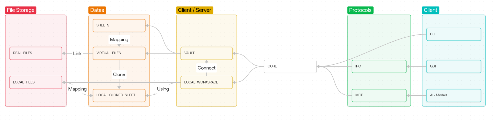

# Just Enough VCS

> 轻量、跨职能、二进制友好的集中式版本控制系统

> [!WARNING]
> JustEnoughVCS 目前正在积极开发中。**
>
> 本软件处于开发阶段，功能尚不完整。

​	`JustEnoughVCS` 是一个为**跨职能团队**设计的轻量级版本控制系统。它允许每个成员以**最适合其职能角色**的文件结构查看和组织文件，使团队能够专注于内容创作本身。它主要服务于大量二进制资产的协作场景，如**游戏开发**和**多媒体设计**。

## 我的设计哲学 - 也是我的拙见 😃

​	`JustEnoughVCS` 遵循 "**Just Enough**" 的理念，旨在通过架构设计来实现协作安全。它以**虚拟文件系统**和**表隔离**为核心，为每个创作者提供专注、无干扰的工作空间，让协作变得自然且简单。

## 虚拟文件系统 (Virtual File System)

​	虚拟文件系统是 `JustEnoughVCS` 的基础。每个文件由一个全局唯一的 `VirtualFileId` 标识，与其物理路径解耦。它全面记录：

-   **所有历史版本**
-   **每次修改的描述信息**
-   **版本号序列**
-   **当前最新版本**
-   **当前文件持有者（拥有编辑权限的成员）**

### 特性

-   **可追溯的历史**：轻松查看任何版本的历史并支持回滚。
-   **无冲突协作**：严格遵守 **"先获取，后编辑"** 原则。文件对所有人**可见**但仅对持有者**可写**，从而防止冲突。
-   **获取前验证**：在获取文件之前，本地文件的哈希值和版本号会被严格验证，以确保编辑从最新版本开始。

## 表系统 (Sheet System)

​	表系统充当连接**虚拟文件**与成员**本地工作区**的桥梁。它建立从 `VirtualFileId` 到本地 `SheetPath` 的映射，为每个职能角色（例如，程序员、艺术家、设计师）或个体成员创建定制化的文件视图。

表分为两种类型，主要区别在于权限管理：

-   **参照表 \(Reference Sheet\)**：存储团队间通用的文件，作为共享资源库。所有成员都可以从中获取文件到自己的表中。成员可以将自己的文件提交到参照表，经管理员审核同意后，即可加入参照表中供其他成员导入到自己的表。
-   **成员表 \(Member Sheet\)**：成员自身的表，用来管理个人的工程、项目和素材。成员拥有对**表结构**的完全管理权（如添加、移动映射关系等），但对文件本身的**编辑权**仍由该文件的持有者独占，遵循"先获取，后编辑"的原则。通常，新追踪的文件会自动将其所有权赋予追踪者。

### 表间传递文件

​	通过表系统提供的 **Import/Export 机制**，成员可以将文件的**映射关系**从一个表传复制到另一个表。此机制传递的是文件的**映射关系**（即 `VirtualFileId` 与路径的绑定），而非文件实体本身。文件实体始终存储在虚拟文件系统中。此机制支持跨表协作，例如将完成的工作成果提交给团队共享，或将文件推荐给特定成员进行后续处理。

-   **Export（导出）**：成员可以将自己表中的文件直接导出至目标表（如参照表或其他成员的表）的待导入区。
-   **Import（导入）**：目标表的所有者会收到待导入文件的列表。所有者可以查看并选择性地将其导入（即添加映射）到自己的表中。在此过程中，文件的**编辑权保持不变**，仅仅是让文件在接收方的表中"可见"。

这种机制确保了文件传递的**可控性**，接收方有权决定是否接受导入文件映射，从而维持了各自工作区的整洁与秩序。

## 支持

在使用 JustEnoughVCS 时遇到任何问题或有建议？

-   请将其提交到 https://github.com/JustEnoughVCS/VersionControl/issues 页面，我们将及时处理您的反馈。

## 许可证

本项目采用 **MIT 许可证**。

有关完整的许可证条款，请参阅项目根目录中的 ./LICENSE-MIT.md 文件。

---

最后，感谢您对 `JustEnoughVCS` 的关注！
